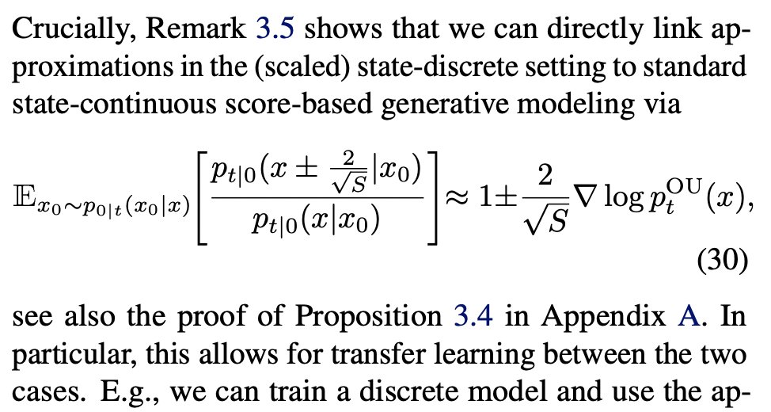
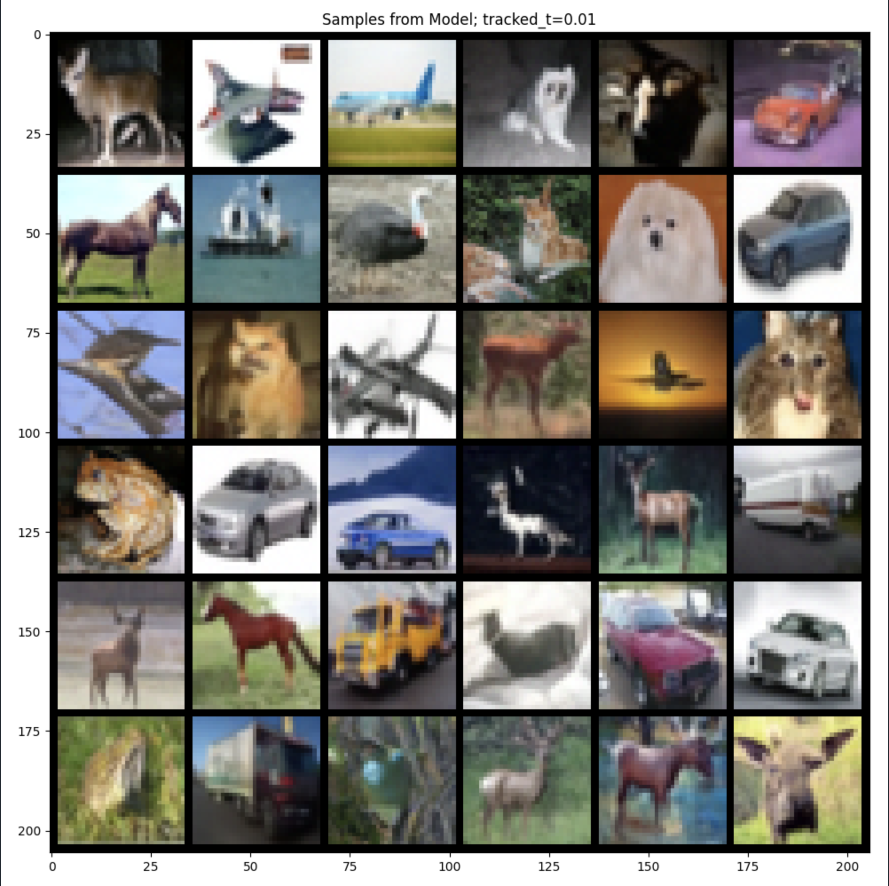

# Bridging discrete and continuous state spaces
## Exploring the Ehrenfest process in time-continuous diffusion models

This repository contains the code for the paper "Bridging discrete and continuous state spaces: Exploring the Ehrenfest process in time-continuous diffusion models" by [Ludwig Winkler*](https://ludwigwinkler.github.io), [Lorenz Richter*](https://scholar.google.com/citations?hl=en&user=uxlQvnUAAAAJ), and Manfred Opper. 

This work was published at [ICML 2024](https://arxiv.org/pdf/2405.03549).

## Abstract

Generative modeling via stochastic processes has led to remarkable empirical results as well as to recent advances in
their theoretical understanding. In principle, both space and time of the processes can be discrete or continuous. 
In this work, we study time-continuous Markov jump processes on discrete state spaces and investigate their correspondence to state-continuous diffusion processes given by SDEs. 
In particular, we re-visit the Ehrenfest process, which converges to an Ornstein-Uhlenbeck process in the infinite state space limit. 
Likewise, we can show that the time-reversal of the Ehrenfest process converges to the time-reversed Ornstein-Uhlenbeck process. This observation bridges
discrete and continuous state spaces and allows to carry over methods from one to the respective other setting.
Additionally, we suggest an algorithm for training the time-reversal of Markov jump processes which relies on conditional expectations and can thus be directly related to denoising score matching. 
We demonstrate our methods in multiple convincing numerical experiments.

### TL;DR
For the first time, we can directly link state-discrete continuous-time diffusion models to their time- and
space-continuous (SDE-based) counterparts, i.e. score-based generative modeling. Credits go to the Ehrenfest process.
Thus we can use models trained in continuous state spaces to model discrete state spaces with the Ehrenfest process and vice versa.

The Ehrenfest $E_S(t)$ process in discrete state spaces is characterized by the birth death rates $r_t(x \pm 1 |x)$ that denote the rate in which the process changes states $x \in \{0, \ldots, S\}$:
$$r_t(x+1|x) = \frac{1}{2}(S-x) \quad \quad \text{and} \quad \quad r_t(x - 1|x) = \frac{x}{2}.$$ 

In the limit of infinite states $S$ the scaled Ehrenfest process $\tilde{E}_S$,

$$ \tilde{E}_S(t) = \frac{2}{\sqrt{S}} \left( E_S(t) - \frac{S}{2} \right)$$

converges to the Ornstein-Uhlenbeck process which underpins many of the generative diffusion models.

The reverse time rate of an Ehrenfest process can be obtained through the ratio of the conditional probabilities of the forward process $p_{t|0}(x | x_0)$ under the expectation of the initial condition of the forward process $p_{0|t}(x_0 | x)$.
In case of the scaled Ehrenfest process $\tilde{E}_S$, the reverse rates can be obtained in the limit of infinite states by the score of the corresponding Ornstein-Uhlenbeck process:

$$ \sim \mathbb{E} \pm \text{OU}  \nabla \log  \sqrt{S} $$

$$\mathbb{E}_{x_0 \sim p_{0|t}(x_0|x)} \left[ p_{t|0} \left(x \pm \frac{2}{\sqrt{S}} | x_0 \right) \right] $$

<!-- $$\mathbb{E}_{x_0 \sim p_{0|t}(x_0|x)} \left[ \frac{p_{t|0}\left(x \pm \frac{2}{\sqrt{S}} | x_0 \right)}{p_{t|0}(x|x_0)} \right] \approx 1 \pm \frac{2}{\sqrt{S}} \nabla \log p_t^{\text{OU}}(x) $$ -->

Thus, we can model reverse-time, discrete-state rates with models predicting the continuous-time score such as DDPM. 

<!--  -->

## Generated Samples from the Ehrenfest Process

### How to use code

Download the [checkpoint](https://drive.google.com/drive/folders/1FlYhDRgc0GA2qNCOB8IvoBRV-62BzCVR) and copy the directory to the `checkpoints` folder (`checkpoints/r4ftq2q0/last.ckpt` and `checkpoints/r4ftq2q0/r4ftq2q0.yaml` should now exist).

Subsequently, run the `main.py` file to generate the samples above.
Importantly, you can use your own score modeling network or denoising diffusion model by converting the output of the model to the Ehrenfest rates as detailed in our paper.
The tau-leaping algorithm is very important to obtain usable sampling speeds.